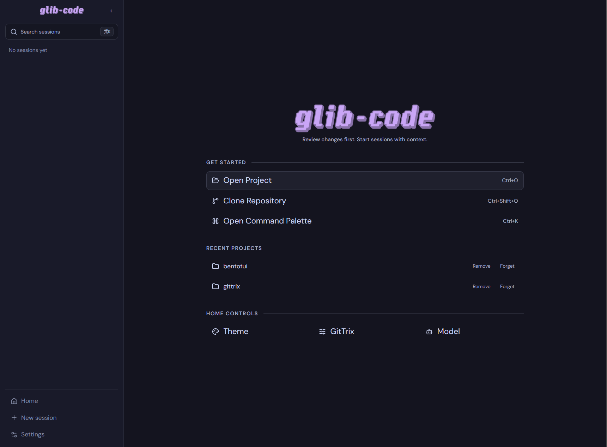

<p align="center">
  
</p>

<p align="center">
  <strong>Review changes first. Start agent sessions with context. Promote only what you accept.</strong>
</p>

<p align="center">
  
</p>

# glib-code

glib-code is a local-first AI coding workspace for reviewing repo changes before asking an agent to work. Agent writes run in an isolated GitTrix workspace and only move back into the durable repo when you explicitly promote them.

## What works now

- Project picker with open/clone/recents flows.
- Diff workbench for uncommitted changes and commit history.
- Session creation backed by GitTrix local ephemeral workspaces.
- Agent runtime backed by `@mariozechner/pi-coding-agent` in-process.
- Provider/model discovery through pi, with glib-owned API key storage.
- SSE timeline streaming for user turns, assistant text, errors, and compact tool-call cards.
- Session diff review and file-level promote back to the durable repo.
- Settings for model access, GitTrix mode visibility, appearance, and keybindings.

## Still in progress

- Terminal WebSocket transport (`/api/term`).
- Attachments API + composer attachment UX (`/api/attachments`).
- Git mutation routes under `/api/git` beyond read/status/log/branches.
- Hunk-level session promote selection.
- Cloudflare Artifacts GitTrix adapter. It stays disabled as `Coming Soon` until the backend adapter lands.

## Runtime boundaries

- pi owns provider/model capability and agent execution.
- glib-code owns user-facing provider key storage under its own app config dir.
- GitTrix owns durable/ephemeral workspace boundaries and promote operations.
- The frontend never hardcodes provider/model catalogs; it renders backend capability state.

Provider keys are stored at:

```txt
Windows: %APPDATA%/glib-code/pi/auth.json
macOS:   ~/Library/Application Support/glib-code/pi/auth.json
Linux:   $XDG_CONFIG_HOME/glib-code/pi/auth.json or ~/.config/glib-code/pi/auth.json
```

## Quick start

Requirements:

- Bun 1.x
- Git

Install:

```bash
bun install
```

Run dev stack:

```bash
bun run dev
```

- API server: `http://127.0.0.1:4273`
- Web app: `http://127.0.0.1:5173`

Add a provider key in Settings → Models before starting an agent session. Project picker and diff review work without a provider key.

## Scripts

```bash
bun run dev         # run server + web with prefixed logs
bun run dev:server  # backend only (:4273)
bun run dev:web     # frontend only (vite)
bun run build       # build shared + server + web + desktop
bun run check       # typecheck all workspaces
```

## Docs

- `Docs/SPEC.md`
- `Docs/Frontend.md`
- `Docs/Backend.md`
- `Docs/Agent.md`
- `Docs/Onboarding.md`
- `Docs/next-steps.md`
- `Docs/frontend-checklist.md`
- `Docs/backend-checklist.md`
- `Docs/T3_UI_PARITY_CHECKLIST.md`
