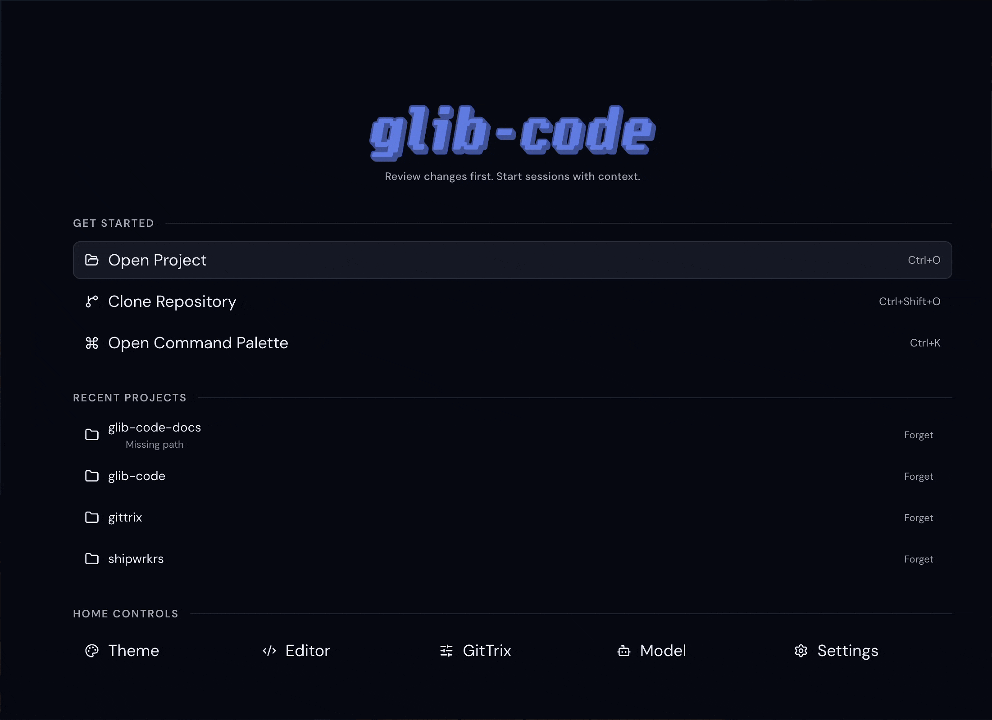

<p align="center">
  
</p>

<p align="center">
  <strong>Start fresh or with context. Work in isolation. Promote only what you accept.</strong>
</p>

<p align="center">
  
</p>

<p align="center">
  <a href="https://github.com/cloudboy-jh/glib-code/releases/latest">
    
  </a>
  
</p>

glib-code is an AI coding agent that lives next to your local repos. Open a project, start a session, let the agent work in an isolated sandbox, review exactly what changed, then apply only the files you want.

## Download

**[→ Latest release](https://github.com/cloudboy-jh/glib-code/releases/latest)**

| Platform | File |
|----------|------|
| Windows | `glib-code-Setup-0.1.3.exe` |
| Mac | `glib-code-0.1.3-arm64.dmg` |
| Linux | `glib-code-0.1.3.AppImage` |

## What it does

- Opens or clones any local Git repository
- Review commit history and working tree diffs before prompting the agent
- Runs sessions in an isolated workspace — your real checkout stays untouched
- Streams assistant output, tool calls, and errors in a live timeline
- Shows a full session diff so you see exactly what the agent changed
- Apply only the files you accept back to your real repo
- Provider key management, model selection, GitHub push, local commit flows

## Dev setup

Requirements: Bun 1.x, Git, a provider API key (OpenAI, Anthropic, or any compatible provider).

```bash
bun install
bun run dev:desktop
```

Starts the API server, Vite, and Electron together. DevTools open automatically in dev mode.

- API: `http://127.0.0.1:4273`
- Web: `http://127.0.0.1:5173`

Add a provider key in **Settings → Models** before starting an agent session.

## Scripts

```bash
bun run dev:desktop    # server + web + Electron (full dev)
bun run dev:server     # API server only
bun run dev:web        # Vite only
bun run build          # build all workspaces
bun run check          # typecheck all workspaces
```

## Releasing

Push a version tag — GitHub Actions builds all three platforms and publishes to a GitHub Release automatically.

```bash
git tag v0.x.y
git push origin v0.x.y
```

Build output is in `desktop/dist-app/`. To build locally without publishing:

```bash
bun run build
bun run --cwd desktop build:local:win   # Windows unpacked dir
bun run --cwd desktop build:local       # Mac unpacked dir
```

## Repo layout

```
server/      Bun + Hono API, session orchestration, agent runtime bridge
web/         Vue 3 frontend — diff workbench, session timeline, settings
desktop/     Electron shell — packaging, first-launch, auto-update
shared/      Types, schemas, theme presets, event contracts
.github/     CI — two-stage release workflow (bun build → node package)
Docs/        Architecture, spec, frontend, backend, agent docs
```

## Themes

<details>
<summary>Theme preview</summary>

<p align="center">
  
</p>

</details>
